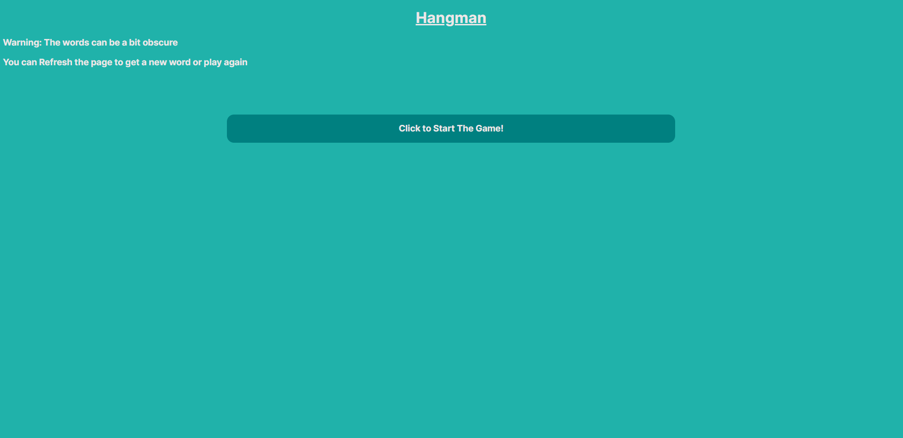
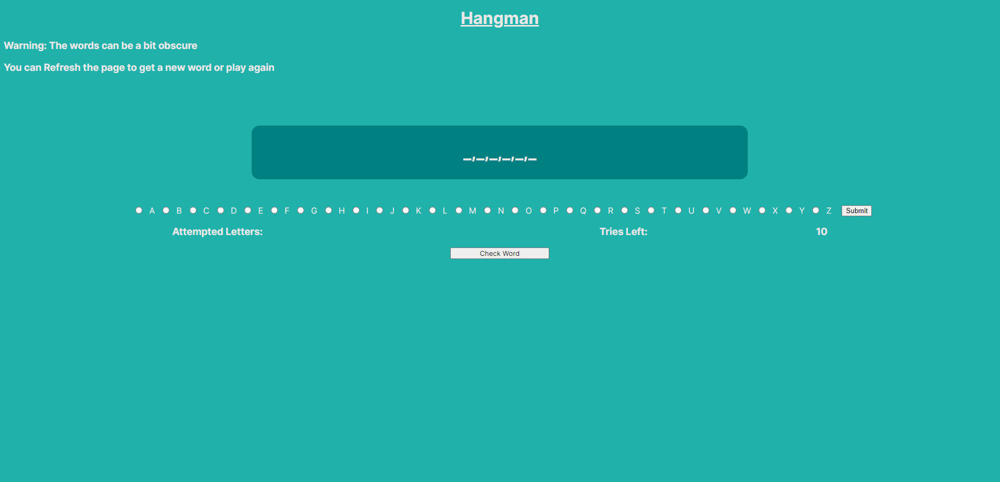

# Hangman

This is a hangman game I built for my project in DevMountain fundamentals. It uses an API to get a random word for you to play. You have 10 tries to guess the word. If you run out of tries, you loose. If you can guess all the letters, you win.

When you reach the site, this is what you should be greeted by.

After you begin a game, this is what you shoudl see. If you click on one of the letter options and hit submit, It will send back a letter as your guess. If it's correct, it will fill in one of the blanks on the screen. Then you can guess again untill the game finishes.
